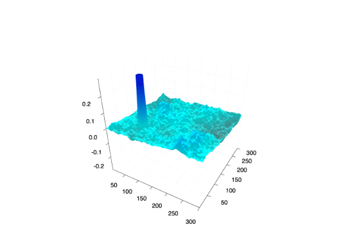
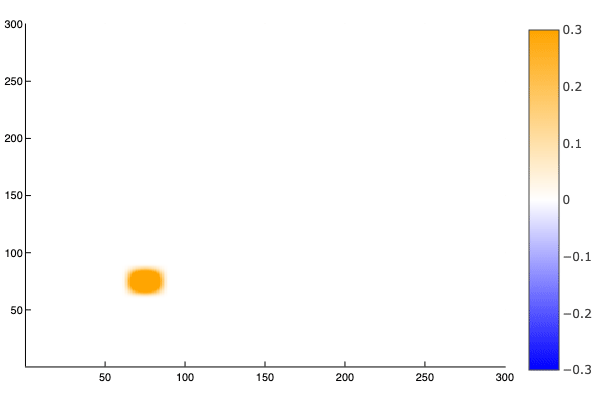

# tsunami_model

Simple tsunami model based on 2-D linear long wave equations, as found in https://agupubs.onlinelibrary.wiley.com/doi/full/10.1002/2015GL065588. Julia implementaton based on existing FORTRAN code found in https://github.com/tktmyd/tdac. 

## Usage

- Functions for setting up initial and boundary conditions found in `setup.jl`.
- Function for simulating tsunami forward in time found in `simulate.jl`.
- For usage see `experiment.jl` and inline comments. Parameters are set in this file for now, model is simulated and animated plots of the wave are produced. 

## Example output
Below are example output animations from running code in `experiment.jl`.

  
   

